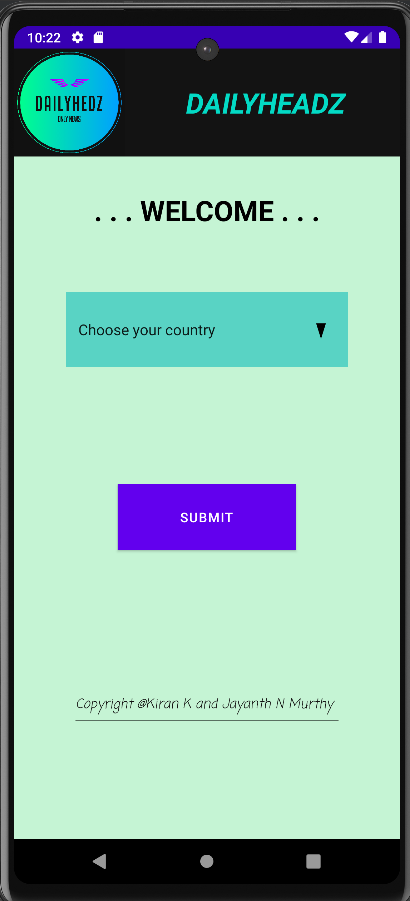

# DAILYHEADZ-A NEWS APP

DAILYHEADZ is a news application that provides users with up-to-date news articles from various countries and categories, including business, science, sports, and more. Users can select their country to receive news relevant to their location.

## Features
- Fetches news articles from News API.
- Allows users to select their country to receive location-based news.
- Provides news articles in various categories such as business, science, sports, etc.
- Responsive design for use on desktop and mobile devices.

## Technologies Used
- Java
- XML
- Android Studio

## Getting Started
- Clone the repository: `git clone https://github.com/yourusername/DAILYHEADZ.git`
- Import the project into Android Studio.
- Run the project on an Android emulator or physical device.

## Screenshots

</img>   </img>      </img>

